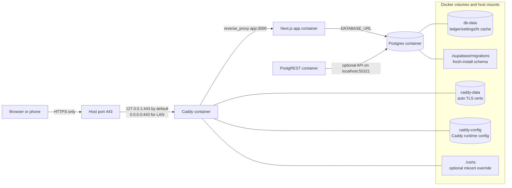
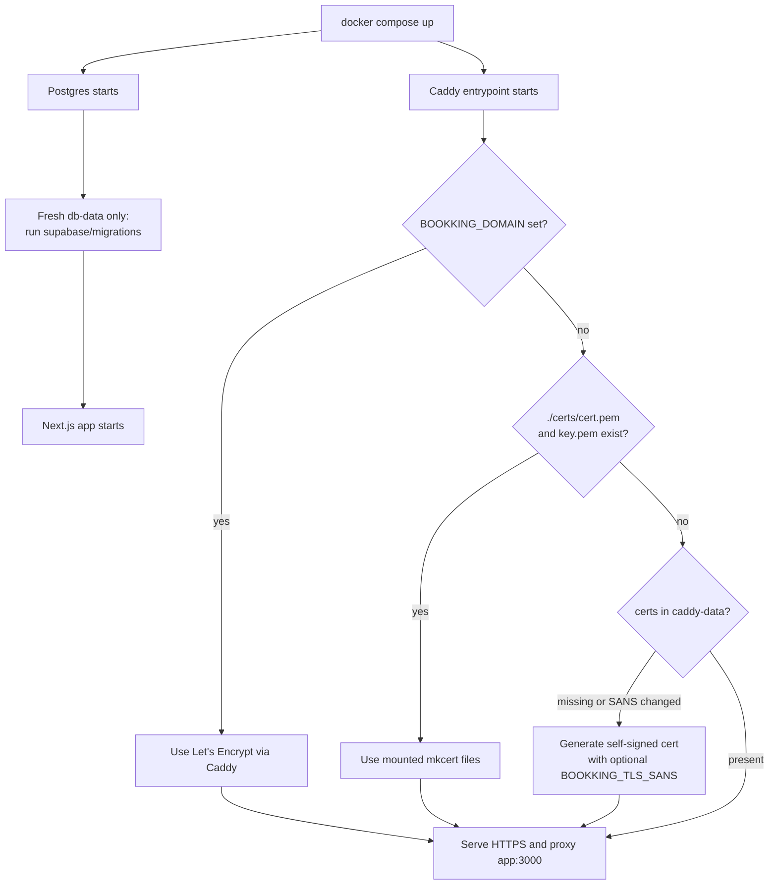
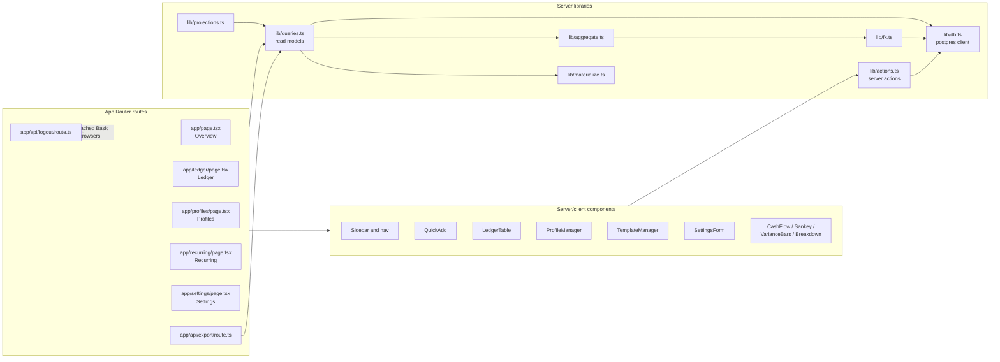
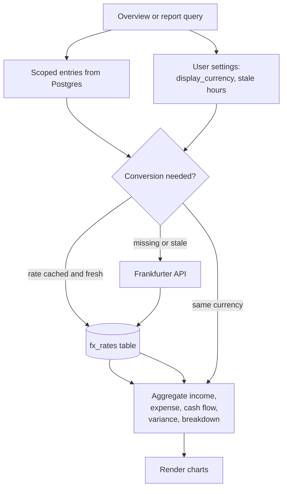
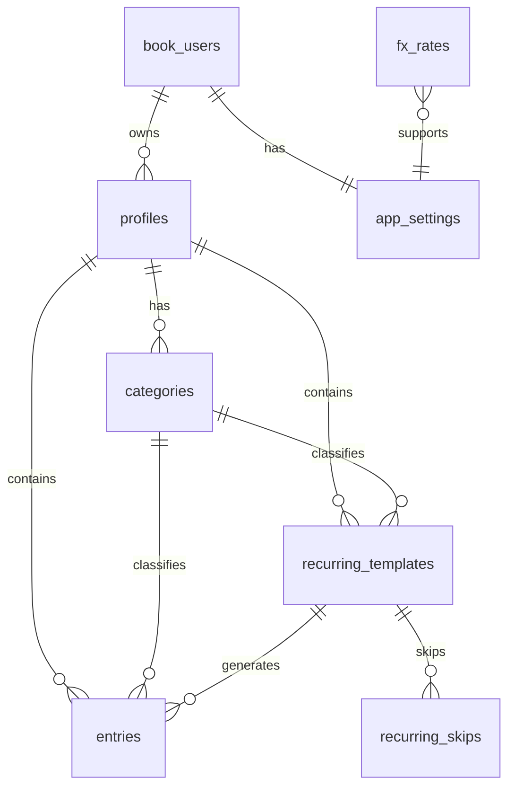

# Architecture

This file is the shared map for contributors and agents. Update it whenever a
change alters routing, containers, persistence, authentication, migrations, or a
major data flow.

## Container And Network Flow



Key points:

- The app is not exposed directly on the host. It is reachable only through Caddy.
- Caddy serves HTTPS on port 443. There is no intentional HTTP endpoint.
- Default compose binding is localhost-only. LAN use requires changing the Caddy
  port binding to `0.0.0.0:443:443`.
- `./certs/cert.pem` and `./certs/key.pem` override auto-generated Caddy certs.
- `db-data` is the durable application data volume. Do not remove it unless the
  user wants to wipe their ledger.

## Startup And TLS Flow



TLS modes:

- Public domain: set `BOOKKING_DOMAIN` and `ACME_EMAIL`; Caddy handles ACME.
- Trusted local development: run `scripts/setup-certs.*`; Caddy uses files from
  `./certs`.
- Zero-manual-step local HTTPS: Caddy generates a self-signed cert in `caddy-data`.
  Browsers may warn because private self-signed certs are not publicly trusted.

## Request, Authentication, And User Scope

```mermaid
flowchart TD
  request[Incoming HTTPS request]
  caddy[Caddy reverse proxy]
  proxy[app/src/proxy.ts]
  auth[app/src/lib/auth.ts]
  allowed{Basic auth valid\nor auth disabled?}
  route[Next route or API route]
  session[app/src/lib/session.ts]
  username{Authenticated username?}
  local[local user\nwhen auth disabled]
  ensure[ensureUser(username)]
  seed[Create book_users row,\nseed profile/categories,\ncreate settings if missing]
  userId[currentUserId]
  deny[401 Basic auth challenge]

  request --> caddy --> proxy --> auth --> allowed
  allowed -->|no| deny
  allowed -->|yes| route --> session --> username
  username -->|yes| ensure
  username -->|auth disabled| local --> ensure
  ensure --> seed --> userId
```

Rules for contributors and agents:

- Every database read/write that touches user data must scope by `currentUserId()`
  directly or through joins to profiles owned by that user.
- `book_users.username` is the stable identity for HTTP Basic auth users.
- When auth is disabled, all local use maps to the `local` user.
- The first account after the multi-user migration claims legacy profiles whose
  `profiles.user_id` is null.

## Next.js Application Flow



Design conventions:

- Pages are mostly server-rendered through the Next.js App Router.
- Mutations live in `lib/actions.ts` as server actions and call `revalidatePath`
  after writes.
- Read models live in `lib/queries.ts`; shared calculations live in `aggregate`,
  `projections`, `money`, and `dates`.
- Charts are UI components fed by already-scoped server data.

## Ledger Write Flow

```mermaid
flowchart TD
  form[UI form or table action]
  action[lib/actions.ts server action]
  user[currentUserId]
  ownership[Check profile/category ownership]
  valid{Valid input and owned records?}
  write[Insert/update/delete Postgres row]
  revalidate[revalidatePath('/', 'layout')]
  rerender[Next.js rerenders affected pages]
  error[Return validation error]

  form --> action --> user --> ownership --> valid
  valid -->|no| error
  valid -->|yes| write --> revalidate --> rerender
```

Important invariants:

- Amounts must be positive for ledger entries and recurring templates.
- Entries belong to profiles and categories. User ownership is enforced through
  the profile relationship.
- Deleting an auto-generated recurring entry records a skip so it is not recreated.

## Recurring Materialization Flow

```mermaid
flowchart TD
  pageRead[Page/API read]
  ensure[ensureRecurringMaterialized]
  user[currentUserId]
  materialize[materializeRecurringEntries(userId)]
  templates[Load active recurring_templates]
  due[Calculate due periods]
  skips[Check recurring_skips]
  existing[Check existing entries]
  insert[Insert missing generated entries]
  read[Continue requested query]

  pageRead --> ensure --> user --> materialize --> templates --> due
  due --> skips --> existing --> insert --> read
  existing -->|already present| read
  skips -->|user skipped| read
```

Recurring behavior is intentionally lazy: due rows are created on reads instead
of by a scheduler. This keeps the self-hosted stack simple and deterministic.

## FX And Reporting Flow



FX rates are cached in Postgres and refreshed based on the user's settings.

## Database Shape



Migration files:

- `0001_init.sql` creates the single-user schema and seed data.
- `0002_recurring_materialize.sql` adds recurring templates, generated entries,
  and skips.
- `0003_users.sql` adds `book_users` and per-user scoping.

Fresh installs run migrations automatically through the Postgres init directory.
Existing `db-data` volumes do not rerun migrations during upgrades.

## Where To Change Things

| Change area | Primary files |
| --- | --- |
| Docker, ports, volumes | `docker-compose.yml` |
| HTTPS/TLS startup | `caddy/Dockerfile`, `caddy/entrypoint.sh`, `scripts/setup-certs.*` |
| Auth gate | `app/src/proxy.ts`, `app/src/lib/auth.ts` |
| User identity and seeding | `app/src/lib/session.ts`, `app/src/lib/seed-data.ts` |
| Read models | `app/src/lib/queries.ts` |
| Mutations | `app/src/lib/actions.ts` |
| Recurring logic | `app/src/lib/materialize.ts`, `app/src/lib/projections.ts` |
| FX and money math | `app/src/lib/fx.ts`, `app/src/lib/money.ts`, `app/src/lib/aggregate.ts` |
| Schema changes | `supabase/migrations/*.sql` |
| App UI | `app/src/app/*`, `app/src/components/*` |
| Agent guidance | `app/AGENTS.md`, `app/CLAUDE.md` |

When making architecture-affecting changes, update this document in the same PR.
